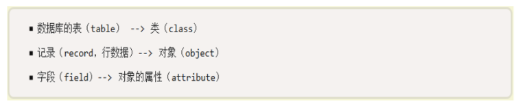
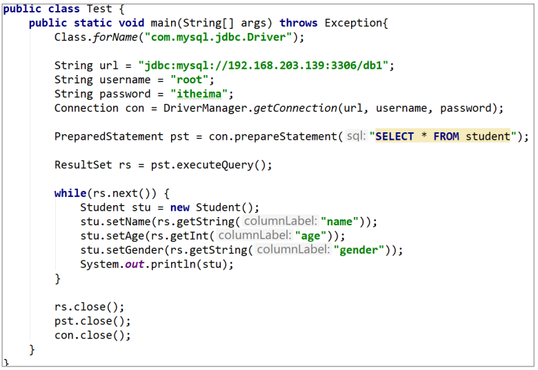
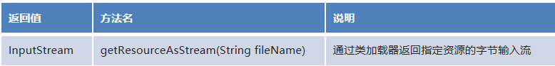
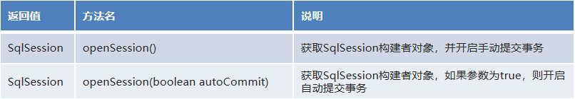
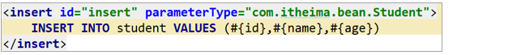
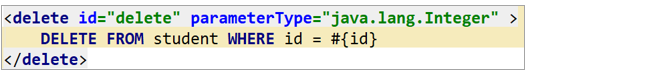
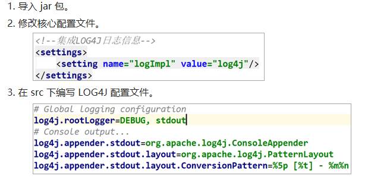
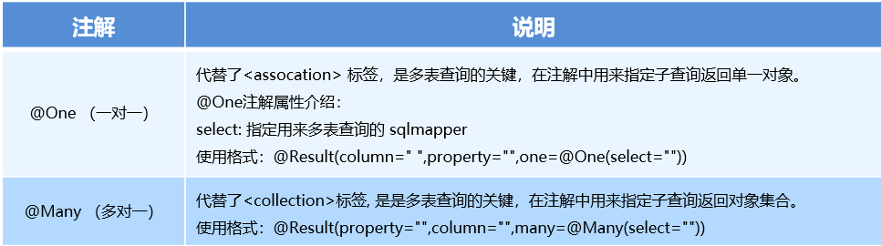
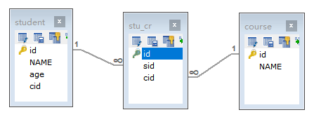

# 一.Mybatis快速入门

## 1.1 框架介绍

* 框架是一款半成品软件，我们可以基于这个半成品软件继续开发，来完成我们个性化的需求！

* 如图:

    

 

## 1.2 ORM介绍

* ORM(Object Relational Mapping)： 对象关系映射

* 指的是持久化数据和实体对象的映射模式，为了解决面向对象与关系型数据库存在的互不匹配的现象的技术。

* 如图:

    

* 具体映射关系如下图:



#### 1.3 原始jdbc操作（查询数据）



#### 1.4原始jdbc操作（插入数据）


#### 1.5 原始jdbc操作的分析

* 原始 JDBC 的操作问题分析 

        1.频繁创建和销毁数据库的连接会造成系统资源浪费从而影响系统性能。
        2. sql 语句在代码中硬编码，如果要修改 sql 语句，就需要修改 java 代码，造成代码不易维护。
        3. 查询操作时，需要手动将结果集中的数据封装到实体对象中。
        4. 增删改查操作需要参数时，需要手动将实体对象的数据设置到 sql 语句的占位符。 

* 原始 JDBC 的操作问题解决方案 

    ​    1.使用数据库连接池初始化连接资源。 

    2. 将 sql 语句抽取到配置文件中。 
    3. ==使用反射、内省等底层技术，将实体与表进行属性与字段的自动映射 （怎么理解）==

#### 1.6 什么是Mybatis

持久层就是数据层Dao类

mybatis 是一个优秀的基于java的持久层框架，它内部封装了jdbc，使开发者只需要关注sql语句本身，而不需要花费精力去处理加载驱动、创建连接、创建statement等繁杂的过程。

mybatis通过xml或注解的方式将要执行的各种 statement配置起来，并通过java对象和statement中sql的动态参数进行映射生成最终执行的sql语句。

最后mybatis框架执行sql并将结果映射为java对象并返回。采用ORM思想解决了实体和数据库映射的问题，对jdbc 进行了封装，屏蔽了jdbc api 底层访问细节，使我们不用与jdbc api 打交道，就可以完成对数据库的持久化操作。

MyBatis官网地址：<http://www.mybatis.org/mybatis-3/> 

#### 1.7  Mybatis的快速入门

**MyBatis开发步骤：**

①添加MyBatis的jar包

②创建Student数据表

③编写Studentr实体类 

④src下编写映射文件StudentMapper.xml ==注意映射配置文件的名字==

⑤src编写核心文件MyBatisConfig.xml ==（注意核心配置文件的名字！）==

⑥编写测试类
最后的目录

老师在这里没有用maven来创建工程，所以这里的jar包还是放在模块下的libs下的！没有进行包的管理


##### 1.7.1  环境搭建

1)导入MyBatis的jar包

* mysql-connector-java-5.1.37-bin.jar
* mybatis-3.5.3.jar
* log4j-1.2.17.jar

2)  创建student数据表


3) 编写Student实体

```java
public class Student {
    // 尽量用包装类
    private Integer id;
    private String name;
    private Integer age;
    //省略get个set方法
}
```

4)编写StudentMapper.xml映射文件

```xml
<?xml version="1.0" encoding="UTF-8" ?>
<!--MyBatis的DTD约束-->
<!DOCTYPE mapper
        PUBLIC "-//mybatis.org//DTD Mapper 3.0//EN"
        "http://mybatis.org/dtd/mybatis-3-mapper.dtd">

<!--
    mapper：核心根标签
    namespace属性：名称空间
-->
<mapper namespace="StudentMapper">
    <!--
        select：查询功能的标签
        id属性：唯一标识
        resultType属性：指定结果映射对象类型,小写名字
        parameterType属性：指定参数映射对象类型
    -->
    <select id="selectAll" resultType="student">
        SELECT * FROM student   // 不用加分号
    </select>
</mapper>
```

5) 编写MyBatis核心文件

```xml
<?xml version="1.0" encoding="UTF-8" ?>
<!--MyBatis的DTD约束-->
<!DOCTYPE configuration PUBLIC "-//mybatis.org//DTD Mapper 3.0//EN"
        "http://mybatis.org/dtd/mybatis-3-mapper.dtd">

<!--configuration 核心根标签-->
<configuration>


    <!--environments配置数据库环境，环境可以有多个。default属性指定使用的是哪个-->
    <environments default="mysql">
        <!--environment配置数据库环境  id属性唯一标识-->
        <environment id="mysql">
            <!-- transactionManager事务管理。  type属性，采用JDBC默认的事务-->
            <transactionManager type="JDBC"></transactionManager>
            <!-- dataSource数据源信息   type属性 连接池-->
            <dataSource type="POOLED">
                <!-- property获取数据库连接的配置信息 -->
                <property name="driver" value="${driver}" />
                <property name="url" value="${url}" />
                <property name="username" value="${username}" />
                <property name="password" value="${password}" />
            </dataSource>
        </environment>
    </environments>

    <!-- mappers引入映射配置文件 -->
    <mappers>
        <!-- mapper 引入指定的映射配置文件   resource属性指定映射配置文件的名称（这里可以是相对路径，也可以用根路径src为跟） -->
        <mapper resource="StudentMapper.xml"/>
    </mappers>
</configuration>

```

##### 1.7.2编写测试代码

```java
// 在持久层去调用映射配置文件中的<select>标签 来验证
public class StudentTest01 {
    public void selectAll() throws Exception{
        //1.加载核心配置文件
        //InputStream is = Resources.getResourceAsStream("MyBatisConfig.xml");
        // 复习下反射这里！//应该是类j
        InputStream is = StudentTest01.class.getClassLoader().getResourceAsStream("MyBatisConfig.xml");

        //2.获取SqlSession工厂对象
        SqlSessionFactory sqlSessionFactory = new SqlSessionFactoryBuilder().build(is);

        //3.通过SqlSession工厂对象获取SqlSession对象
        SqlSession sqlSession = sqlSessionFactory.openSession();

        //4.执行映射配置文件中的sql语句，并接收结果
        List<Student> list = sqlSession.selectList("StudentMapper.selectAll");

        //5.处理结果
        for (Student stu : list) {
            System.out.println(stu);
        }

        //6.释放资源
        sqlSession.close();
        is.close();
    }
}
```


#### 1.8 知识小结

* 框架       

    框架是一款半成品软件，我们可以基于框架继续开发，从而完成一些个性化的需求。

* ORM        

    对象关系映射，数据和实体对象的映射。

* MyBatis       

    是一个优秀的基于 Java 的持久层框架，它内部封装了 JDBC。

#### 1.9 问题：

数据库连接池是什么？JDBC复习下

验证下反射：
加载核心配置文件有两种方式，用第一种

  

# 二. MyBatis的相关api

#### 2.1 Resources

* org.apache.ibatis.io.Resources：加载资源的**工具类。**

* 核心方法

    

#### 2.2 构建器SqlSessionFactoryBuilder


* org.apache.ibatis.session.SqlSessionFactoryBuilder：获取 SqlSessionFactory 工厂对象的**功能类,需要创建对象才能调用方法**

* 核心方法

    

* 通过加载mybatis的核心文件的输入流的形式构建一个SqlSessionFactory对象

    这里的参数就是通过resources.getResourcesAsStream得到了核心文件的输入流

```java
// 复杂写法
String resource = "org/mybatis/builder/mybatis-config.xml"; 
InputStream inputStream = Resources.getResourceAsStream(resource); 
SqlSessionFactoryBuilder builder = new SqlSessionFactoryBuilder(); 
SqlSessionFactory factory = builder.build(inputStream);

//简单写法
 //1.加载核心配置文件
  InputStream is = Resources.getResourceAsStream("MyBatisConfig.xml");
 //2.获取SqlSession工厂对象
        SqlSessionFactory sqlSessionFactory = new SqlSessionFactoryBuilder().build(is);
```

其中， Resources 工具类，这个类在 org.apache.ibatis.io 包中。Resources 类帮助你从类路径下、文件系统或一个 web URL 中加载资源文件。

#### 2.3 工厂对象SqlSessionFactory


* org.apache.ibatis.session.SqlSessionFactory：获取 SqlSession 构建者对象的工厂接口。

* 核心api

    


#### 2.4 SqlSession会话对象（重点）

帮助我们执行功能。

* org.apache.ibatis.session.SqlSession：构建者对象接口。用于执行 SQL、管理事务、接口代理。

* 核心api

    

SqlSession 实例在 MyBatis 中是非常强大的一个类。在这里你会看到所有执行语句、提交或回滚事务和获取映射器实例的方法。


#### 问题：

我记得哪里的myBatis讲了什么是构建者模式，工厂模式，还有代理模式

学习下工厂模式

# 三.MyBatis 映射配置文件

#### 3.1 映射配置文件介绍

* 映射配置文件包含了数据和对象之间的映射关系以及要执行的 SQL 语句
    DTD约束是用来标签书写错误报错和只能提示的
    
    


#### 3.2 查询功能


* <select：>查询功能标签。
* 属性        

    id：唯一标识， 配合名称空间使用。     在映射接口代理中，规范要求id就应该是dao接口的方法名

    parameterType：指定参数映射的对象类型。       

    resultType：指定结果映射的对象类型。

* SQL 获取参数:        #{属性名}

* 示例

    

#### 3.3 新增功能 

- <insert>：新增功能标签。

- 属性        

    id：唯一标识， 配合名称空间使用。     

    parameterType：指定参数映射的对象类型。       

    resultType：指定结果映射的对象类型。

- SQL 获取参数:        #{属性名}

* 示例




#### 3.4 修改功能

- <update>：修改功能标签。

- 属性        

    id：唯一标识， 配合名称空间使用。     

    parameterType：指定参数映射的对象类型。       

    resultType：指定结果映射的对象类型。

- SQL 获取参数:        #{属性名}

* 示例


#### 3.5 删除功能

- <delete>：查询功能标签。

- 属性        

    id：唯一标识， 配合名称空间使用。     

    parameterType：指定参数映射的对象类型。       

    resultType：指定结果映射的对象类型。

- SQL 获取参数:        #{属性名}

* 示例

    

* 总结： 大家可以发现crud操作，除了标签名称以及sql语句不一样之外，其他属性参数基本一致。

#### 3.6 映射配置文件小结

==名称空间很重要，是真正完成匹配的！配对的，填写的就是对应的dao接口==


# 四.Mybatis核心配置文件介绍

#### 4.1 核心配置文件介绍

核心配置文件包含了 MyBatis 最核心的设置和属性信息。如数据库的连接、事务、连接池信息等。

如下图:

~~~xml
<?xml version="1.0" encoding="UTF-8" ?>
<!--MyBatis的DTD约束-->
<!DOCTYPE configuration PUBLIC "-//mybatis.org//DTD Config 3.0//EN" "http://mybatis.org/dtd/mybatis-3-config.dtd">

<!--configuration 核心根标签-->
<configuration>

    <!--environments配置数据库环境，环境可以有多个。default属性指定使用的是哪个-->
    <environments default="mysql">
        <!--environment配置数据库环境  id属性唯一标识-->
        <environment id="mysql">
            <!-- transactionManager事务管理。  type属性，采用JDBC默认的事务-->
            <transactionManager type="JDBC"></transactionManager>
            <!-- dataSource数据源信息   type属性 连接池-->
            <dataSource type="POOLED">
                <!-- property获取数据库连接的配置信息 -->
                <property name="driver" value="com.mysql.jdbc.Driver" />
                <property name="url" value="jdbc:mysql:///db1" />
                <property name="username" value="root" />
                <property name="password" value="root" />
            </dataSource>
        </environment>
    </environments>

    <!-- mappers引入映射配置文件 -->
    <mappers>
        <!-- mapper 引入指定的映射配置文件   resource属性指定映射配置文件的名称 -->
        <mapper resource="StudentMapper.xml"/>
    </mappers>
</configuration>
~~~

#### 4.2 数据库连接配置文件引入

* properties标签引入外部文件

    ~~~xml
        <!--引入数据库连接的配置文件-->
        <properties resource="jdbc.properties"/>
    ~~~

* 具体使用，如下配置

    ~~~xml
      <!-- property获取数据库连接的配置信息 -->
        <property name="driver" value="${driver}" />
        <property name="url" value="${url}" />
        <property name="username" value="${username}" />
        <property name="password" value="${password}" />
    ~~~

    

#### 4.3 起别名

* <typeAliases>：为全类名起别名的父标签。

* <typeAlias>：为全类名起别名的子标签。

* 属性      

    type：指定全类名      

    alias：指定别名

* <package>：为指定包下所有类起别名的子标签。(别名就是类名)

* 如下图：

    

* 具体如下配置

    ~~~xml
        <!--起别名-->    <typeAliases>        <typeAlias type="com.itheima.bean.Student" alias="student"/>        <!--<package name="com.itheima.bean"/>-->    </typeAliase
    ~~~

#### 4.4 总结


# 五.Mybatis传统方式开发

#### 5.1 Dao 层传统实现方式

* 分层思想：控制层(controller)、业务层(service)、持久层(dao)。

* 调用流程

    

#### 5.2 LOG4J的配置和使用

* 在日常开发过程中，排查问题时难免需要输出 MyBatis 真正执行的 SQL 语句、参数、结果等信息，我们就可以借助 LOG4J 的功能来实现执行信息的输出。

* 使用步骤：

    


# 六.接口代理方式实现Dao

#### 1.1 代理开发方式介绍

​	==采用 Mybatis 的代理开发方式实现 DAO 层的开发，这种方式是我们后面进入企业的主流。==

Mapper 接口开发方法只需要程序员编写Mapper 接口（相当于Dao 接口），由Mybatis 框架根据接口定义创建接口的动态代理对象，代理对象的方法体同上边Dao接口实现类方法。

Mapper 接口开发需要遵循以下规范：

**1) Mapper.xml文件中的namespace与mapper接口的全限定名相同**

**2) Mapper接口方法名和Mapper.xml中定义的每个statement的id相同**

**3) Mapper接口方法的输入参数类型和mapper.xml中定义的每个sql的parameterType的类型相同**

**4) Mapper接口方法的输出参数类型和mapper.xml中定义的每个sql的resultType的类型相同**

总结: 

接口开发的方式: 程序员只需定义接口,就可以对数据库进行操作,那么具体的对象怎么创建?

1.程序员负责定义接口

2.在操作数据库,mybatis框架根据接口,通过动态代理的方式生成代理对象,负责数据库的crud操作

#### 1.2.编写StudentMapper接口


#### 1.3 测试代理方式

```java
 public Student selectById(Integer id) {
        Student stu = null;
        SqlSession sqlSession = null;
        InputStream is = null;
        try{
            //1.加载核心配置文件
            is = Resources.getResourceAsStream("MyBatisConfig.xml");

            //2.获取SqlSession工厂对象
            SqlSessionFactory sqlSessionFactory = new SqlSessionFactoryBuilder().build(is);

            //3.通过工厂对象获取SqlSession对象
            sqlSession = sqlSessionFactory.openSession(true);

            //4.获取StudentMapper接口的实现类对象
            StudentMapper mapper = sqlSession.getMapper(StudentMapper.class); // StudentMapper mapper = new StudentMapperImpl();

            //5.通过实现类对象调用方法，接收结果
            stu = mapper.selectById(id);

        } catch (Exception e) {

        } finally {
            //6.释放资源
            if(sqlSession != null) {
                sqlSession.close();
            }
            if(is != null) {
                try {
                    is.close();
                } catch (IOException e) {
                    e.printStackTrace();
                }
            }
        }

        //7.返回结果
        return stu;
    }
```

#### 1.4 源码分析

* 分析动态代理对象如何生成的？ 

    通过动态代理开发模式，我们只编写一个接口，不写实现类，我们通过 getMapper() 方法最终获取到 org.apache.ibatis.binding.MapperProxy 代理对象，然后执行功能，而这个==代理对象正是 MyBatis 使用了 JDK 的动态代理技术，帮助我们生成了代理实现类对象。从而可以进行相关持久化操作。==

* 分析方法是如何执行的？

    动态代理实现类对象在执行方法的时候最终调用了 mapperMethod.execute() 方法，这个方法中通过 switch 语句根据操作类型来判断是新增、修改、删除、查询操作，最后一步回到了 MyBatis 最原生的 SqlSession 方式来执行增删改查。    

#### 1.5 知识小结

 接口代理方式可以让我们只编写接口即可，而实现类对象由 MyBatis 生成。 

 实现规则 ：

1. 映射配置文件中的名称空间必须和 Dao 层接口的==全类名相同。==
2. 映射配置文件中的增删改查标签的 id 属性必须和 Dao 层接口的方法名相同。 
3. 映射配置文件中的增删改查标签的 parameterType 属性必须和 Dao 层接口方法的参数相同。 
4. 映射配置文件中的增删改查标签的 resultType 属性必须和 Dao 层接口方法的返回值相同。 
5. 获取动态代理对象 SqlSession 功能类中的 getMapper() 方法。    

# 七. 动态sql语句

#### 2.1 动态sql语句概述

​	Mybatis 的映射文件中，前面我们的 SQL 都是比较简单的，有些时候业务逻辑复杂时，我们的 SQL是动态变化的，此时在前面的学习中我们的 SQL 就不能满足要求了。

参考的官方文档，描述如下：


#### 2.2 动态 SQL  之<**if>** 

我们根据实体类的不同取值，使用不同的 SQL语句来进行查询。比如在 id如果不为空时可以根据id查询，如果username 不同空时还要加入用户名作为条件。这种情况在我们的多条件组合查询中经常会碰到。

如下图：

```xml
<select id="findByCondition" parameterType="student" resultType="student">
    select * from student
    <where>
        <if test="id!=0">
            and id=#{id}
        </if>
        <if test="username!=null">
            and username=#{username}
        </if>
    </where>
</select>

```

当查询条件id和username都存在时，控制台打印的sql语句如下：

```java
     … … …
     //获得MyBatis框架生成的StudentMapper接口的实现类
    StudentMapper mapper = sqlSession.getMapper( StudentMapper.class);
    Student condition = new Student();
    condition.setId(1);
    condition.setUsername("lucy");
    Student student = mapper.findByCondition(condition);
    … … …
```


当查询条件只有id存在时，控制台打印的sql语句如下：

```java
 … … …
 //获得MyBatis框架生成的UserMapper接口的实现类
 StudentMapper mapper = sqlSession.getMapper( StudentMapper.class);
    Student condition = new Student();
    condition.setId(1);
    Student student = mapper.findByCondition(condition);
… … …

```


总结语法:

~~~xml
<where>：条件标签。如果有动态条件，则使用该标签代替 where 关键字。
<if>：条件判断标签。
<if test=“条件判断”>
	查询条件拼接
</if>
~~~


#### 2.3  动态 SQL  之<**foreach>** 

循环执行sql的拼接操作，例如：SELECT * FROM student  WHERE id IN (1,2,5)。

 ```xml
<select id="findByIds" parameterType="list" resultType="student">
    select * from student
    <where>
        <foreach collection="array" open="id in(" close=")" item="id" separator=",">
            #{id}
        </foreach>
    </where>
</select>
 ```

测试代码片段如下：==**为什么上面的参数是list,下面提供的却是数组？**==

```java
 … … …
 //获得MyBatis框架生成的UserMapper接口的实现类
StudentMapper mapper = sqlSession.getMapper(StudentMapper.class);
int[] ids = new int[]{2,5};
List<Student> sList = mapper.findByIds(ids);   这里上面的返回值类型是student，这里用list来接收！注意理解这里的类型
System.out.println(sList);
… … …

```

总结语法:

~~~xml
<foreach>：循环遍历标签。适用于多个参数或者的关系。
    <foreach collection=“”open=“”close=“”item=“”separator=“”>
		获取参数
	</foreach>
~~~

属性
collection：参数容器类型， (list-集合， array-数组)。
open：开始的 SQL 语句。
close：结束的 SQL 语句。
item：参数变量名。
separator：分隔符。

#### 2.4  SQL片段抽取

Sql 中可将重复的 sql 提取出来，使用时用 include 引用即可，最终达到 sql 重用的目的

```xml
<!--抽取sql片段简化编写-->
<sql id="selectStudent"> select * from student</sql>
<select id="findById" parameterType="int" resultType="student">
    <include refid="selectStudent"></include> where id=#{id}
</select>
<select id="findByIds" parameterType="list" resultType="student">
    <include refid="selectStudent"></include>
    <where>
        <foreach collection="array" open="id in(" close=")" item="id" separator=",">
            #{id}
        </foreach>
    </where>
</select>
```

总结语法:

我们可以将一些重复性的 SQL 语句进行抽取，以达到复用的效果。 

注意在include标签使用的时候,不用必须成对出现,在标签末尾加斜杠.---CYC

~~~xml
-  <sql>：抽取 SQL 语句标签。 
-  <include>：引入 SQL 片段标签。 
   <sql id=“片段唯一标识”>抽取的 SQL 语句</sql> <include refid=“片段唯一标识”/>
 
~~~

#### 2.5 知识小结

MyBatis映射文件配置：

~~~xml
<select>：查询

<insert>：插入

<update>：修改

<delete>：删除

<where>：where条件

<if>：if判断

<foreach>：循环

<sql>：sql片段抽取
<set> :设置属性
~~~

==**老师这里没讲：**==


# 八. 分页插件

#### 3.1 分页插件介绍


* 分页可以将很多条结果进行分页显示。 
* 如果当前在第一页，则没有上一页。如果当前在最后一页，则没有下一页。 
* 需要明确当前是第几页，这一页中显示多少条结果。    
* MyBatis分页插件总结
    1. 在企业级开发中，分页也是一种常见的技术。而目前使用的 MyBatis 是不带分页功能的，如果想实现分页的 功能，需要我们手动编写 LIMIT 语句。但是不同的数据库实现分页的 SQL 语句也是不同的，所以手写分页 成本较高。这个时候就可以借助分页插件来帮助我们实现分页功能。 
    2. PageHelper：第三方分页助手。将复杂的分页操作进行封装，从而让分页功能变得非常简单。    

#### 3.2 分页插件的使用

MyBatis可以使用第三方的插件来对功能进行扩展，分页助手PageHelper是将分页的复杂操作进行封装，使用简单的方式即可获得分页的相关数据

开发步骤：

①导入与PageHelper的jar包

②在mybatis核心配置文件中配置PageHelper插件

~~~xml
<!-- 注意：分页助手的插件  配置在通用mapper之前 -->
<plugin interceptor="com.github.pagehelper.PageHelper">
    <!-- 指定方言，也就是指定使用哪种数据库 -->
    <property name="dialect" value="mysql"/>
</plugin>
~~~

③测试分页数据获取

~~~java
@Test
public void testPageHelper(){
    //设置分页参数
    ？？？这里的参数代表什么含义  第一个是page，第二个是size,应该和之前mysql的limit不一样，不是limit 10,3 从第10个开始选第三个
        这里是说查第一页，每页显示2条，页数从1开始
    PageHelper.startPage(1,2);

    List<User> select = userMapper2.select(null);
    for(User user : select){
        System.out.println(user);
    }
}
~~~

#### 3.3 分页插件的参数获取

**获得分页相关的其他参数**：==这些是怎么用的？==

```java
//其他分页的数据
PageInfo<User> pageInfo = new PageInfo<User>(select);
System.out.println("总条数："+pageInfo.getTotal());
System.out.println("总页数："+pageInfo.getPages());
System.out.println("当前页："+pageInfo.getPageNum());
System.out.println("每页显示长度："+pageInfo.getPageSize());
System.out.println("是否第一页："+pageInfo.isIsFirstPage());
System.out.println("是否最后一页："+pageInfo.isIsLastPage());

```

#### 3.4  分页插件知识小结

​    分页：可以将很多条结果进行分页显示。 

* 分页插件 jar 包： pagehelper-5.1.10.jar jsqlparser-3.1.jar 

* <plugins>：集成插件标签。 

* 分页助手相关 API 

    ​    1.PageHelper：分页助手功能类。

    2. startPage()：设置分页参数 
    3. PageInfo：分页相关参数功能类。 
    4. getTotal()：获取总条数 
    5. getPages()：获取总页数
    6. getPageNum()：获取当前页
    7. getPageSize()：获取每页显示条数
    8. getPrePage()：获取上一页 
    9. getNextPage()：获取下一页 
    10. isIsFirstPage()：获取是否是第一页 
    11. isIsLastPage()：获取是否是最后一页    

# 九.MyBatis的多表操作

#### 4.1 多表模型介绍

我们之前学习的都是基于单表操作的，而实际开发中，随着业务难度的加深，肯定需要多表操作的。 

*  多表模型分类 一对一：在任意一方建立外键，关联对方的主键。
*  一对多：在多的一方建立外键，关联一的一方的主键。
*  多对多：借助中间表，中间表至少两个字段，分别关联两张表的主键。    

#### 4.2 多表模型一对一操作

1. 一对一模型： 人和身份证，一个人只有一个身份证

2. 代码实现

    * 步骤一: sql语句准备

        ~~~sql
        CREATE TABLE person(
        	id INT PRIMARY KEY AUTO_INCREMENT,
        	NAME VARCHAR(20),
        	age INT
        );
        INSERT INTO person VALUES (NULL,'张三',23);
        INSERT INTO person VALUES (NULL,'李四',24);
        INSERT INTO person VALUES (NULL,'王五',25);
        
        CREATE TABLE card(
        	id INT PRIMARY KEY AUTO_INCREMENT,
        	number VARCHAR(30),
        	pid INT,
        	CONSTRAINT cp_fk FOREIGN KEY (pid) REFERENCES person(id)
        );
        INSERT INTO card VALUES (NULL,'12345',1);
        INSERT INTO card VALUES (NULL,'23456',2);
        INSERT INTO card VALUES (NULL,'34567',3);
        ~~~

    * 步骤二:配置文件

        ~~~xml
        <?xml version="1.0" encoding="UTF-8" ?>
        <!DOCTYPE mapper
                PUBLIC "-//mybatis.org//DTD Mapper 3.0//EN"
                "http://mybatis.org/dtd/mybatis-3-mapper.dtd">
        
        <mapper namespace="com.itheima.table01.OneToOneMapper">
            <!--配置字段和实体对象属性的映射关系-->
            <resultMap id="oneToOne" type="card">
                <id column="cid" property="id" />
                <result column="number" property="number" />
                <!--
                    association：配置被包含对象的映射关系
                    property：被包含对象的变量名
                    javaType：被包含对象的数据类型
                -->
                <association property="p" javaType="person">
                    <id column="pid" property="id" />
                    <result column="name" property="name" />
                    <result column="age" property="age" />
                </association>
            </resultMap>
        
            <select id="selectAll" resultMap="oneToOne">
                SELECT c.id cid,number,pid,NAME,age FROM card c,person p WHERE c.pid=p.id
            </select>
        </mapper>
        ~~~

    * 步骤三：测试类

        ~~~java
         @Test
            public void selectAll() throws Exception{
                //1.加载核心配置文件
                InputStream is = Resources.getResourceAsStream("MyBatisConfig.xml");
        
                //2.获取SqlSession工厂对象
                SqlSessionFactory sqlSessionFactory = new SqlSessionFactoryBuilder().build(is);
        
                //3.通过工厂对象获取SqlSession对象
                SqlSession sqlSession = sqlSessionFactory.openSession(true);
        
                //4.获取OneToOneMapper接口的实现类对象
                OneToOneMapper mapper = sqlSession.getMapper(OneToOneMapper.class);
        
                //5.调用实现类的方法，接收结果
                List<Card> list = mapper.selectAll();
        
                //6.处理结果
                for (Card c : list) {
                    System.out.println(c);
                }
        
                //7.释放资源
                sqlSession.close();
                is.close();
            }
        ~~~

    3.一对一配置总结:

    ~~~xml-dtd
    <resultMap>：配置字段和对象属性的映射关系标签。    id 属性：唯一标识    type 属性：实体对象类型<id>：配置主键映射关系标签。<result>：配置非主键映射关系标签。    column 属性：表中字段名称    property 属性： 实体对象变量名称<association>：配置被包含对象的映射关系标签。    property 属性：被包含对象的变量名    javaType 属性：被包含对象的数据类型
    ~~~

    

#### 4.3 多表模型一对多操作

1. 一对多模型： 一对多模型：班级和学生，一个班级可以有多个学生。    

2. 代码实现

    - 步骤一: sql语句准备

        ```sql
        CREATE TABLE classes(
        	id INT PRIMARY KEY AUTO_INCREMENT,
        	NAME VARCHAR(20)
        );
        INSERT INTO classes VALUES (NULL,'黑马一班');
        INSERT INTO classes VALUES (NULL,'黑马二班');
        
        
        CREATE TABLE student(
        	id INT PRIMARY KEY AUTO_INCREMENT,
        	NAME VARCHAR(30),
        	age INT,
        	cid INT,
        	CONSTRAINT cs_fk FOREIGN KEY (cid) REFERENCES classes(id)
        );
        INSERT INTO student VALUES (NULL,'张三',23,1);
        INSERT INTO student VALUES (NULL,'李四',24,1);
        INSERT INTO student VALUES (NULL,'王五',25,2);
        INSERT INTO student VALUES (NULL,'赵六',26,2);
        ```

    - 步骤二:配置文件

        ```xml
        <mapper namespace="com.itheima.table02.OneToManyMapper">
            <resultMap id="oneToMany" type="classes">
                <id column="cid" property="id"/>
                <result column="cname" property="name"/>
        
                <!--
                    collection：配置被包含的集合对象映射关系
                    property：被包含对象的变量名
                    ofType：被包含对象的实际数据类型
                -->
                <collection property="students" ofType="student">
                    <id column="sid" property="id"/>
                    <result column="sname" property="name"/>
                    <result column="sage" property="age"/>
                </collection>
            </resultMap>
            <select id="selectAll" resultMap="oneToMany">
                SELECT c.id cid,c.name cname,s.id sid,s.name sname,s.age sage FROM classes c,student s WHERE c.id=s.cid
            </select>
        </mapper>
        ```

    - 步骤三：测试类

        ```java
            @Test
            public void selectAll() throws Exception{
                //1.加载核心配置文件
                InputStream is = Resources.getResourceAsStream("MyBatisConfig.xml");
        
                //2.获取SqlSession工厂对象
                SqlSessionFactory sqlSessionFactory = new SqlSessionFactoryBuilder().build(is);
        
                //3.通过工厂对象获取SqlSession对象
                SqlSession sqlSession = sqlSessionFactory.openSession(true);
        
                //4.获取OneToManyMapper接口的实现类对象
                OneToManyMapper mapper = sqlSession.getMapper(OneToManyMapper.class);
        
                //5.调用实现类的方法，接收结果
                List<Classes> classes = mapper.selectAll();
        
                //6.处理结果
                for (Classes cls : classes) {
                    System.out.println(cls.getId() + "," + cls.getName());
                    List<Student> students = cls.getStudents();
                    for (Student student : students) {
                        System.out.println("\t" + student);
                    }
                }
        
                //7.释放资源
                sqlSession.close();
                is.close();
            }
        ```

    3.一对多配置文件总结：

    ~~~xml-dtd
    <resultMap>：配置字段和对象属性的映射关系标签。
        id 属性：唯一标识
        type 属性：实体对象类型
    <id>：配置主键映射关系标签。
    <result>：配置非主键映射关系标签。
        column 属性：表中字段名称
        property 属性： 实体对象变量名称
    <collection>：配置被包含集合对象的映射关系标签。
        property 属性：被包含集合对象的变量名
        ofType 属性：集合中保存的对象数据类型
    ~~~

     

#### 4.4 多表模型多对多操作

1. 多对多模型：学生和课程，一个学生可以选择多门课程、一个课程也可以被多个学生所选择。       

2. 代码实现

    - 步骤一: sql语句准备

        ```sql
        CREATE TABLE course(
        	id INT PRIMARY KEY AUTO_INCREMENT,
        	NAME VARCHAR(20)
        );
        INSERT INTO course VALUES (NULL,'语文');
        INSERT INTO course VALUES (NULL,'数学');
        
        
        CREATE TABLE stu_cr(
        	id INT PRIMARY KEY AUTO_INCREMENT,
        	sid INT,
        	cid INT,
        	CONSTRAINT sc_fk1 FOREIGN KEY (sid) REFERENCES student(id),
        	CONSTRAINT sc_fk2 FOREIGN KEY (cid) REFERENCES course(id)
        );
        INSERT INTO stu_cr VALUES (NULL,1,1);
        INSERT INTO stu_cr VALUES (NULL,1,2);
        INSERT INTO stu_cr VALUES (NULL,2,1);
        INSERT INTO stu_cr VALUES (NULL,2,2);
        ```

    - 步骤二:配置文件

        ```xml
        <?xml version="1.0" encoding="UTF-8" ?>
        <!DOCTYPE mapper
                PUBLIC "-//mybatis.org//DTD Mapper 3.0//EN"
                "http://mybatis.org/dtd/mybatis-3-mapper.dtd">
        
        <mapper namespace="com.itheima.table03.ManyToManyMapper">
            <resultMap id="manyToMany" type="student">
                <id column="sid" property="id"/>
                <result column="sname" property="name"/>
                <result column="sage" property="age"/>
        
                <collection property="courses" ofType="course">
                    <id column="cid" property="id"/>
                    <result column="cname" property="name"/>
                </collection>
            </resultMap>
            <select id="selectAll" resultMap="manyToMany">
                SELECT sc.sid,s.name sname,s.age sage,sc.cid,c.name cname FROM student s,course c,stu_cr sc WHERE sc.sid=s.id AND sc.cid=c.id
            </select>
        </mapper>
        ```

    - 步骤三：测试类

        ```java
         @Test
            public void selectAll() throws Exception{
                //1.加载核心配置文件
                InputStream is = Resources.getResourceAsStream("MyBatisConfig.xml");
        
                //2.获取SqlSession工厂对象
                SqlSessionFactory sqlSessionFactory = new SqlSessionFactoryBuilder().build(is);
        
                //3.通过工厂对象获取SqlSession对象
                SqlSession sqlSession = sqlSessionFactory.openSession(true);
        
                //4.获取ManyToManyMapper接口的实现类对象
                ManyToManyMapper mapper = sqlSession.getMapper(ManyToManyMapper.class);
        
                //5.调用实现类的方法，接收结果
                List<Student> students = mapper.selectAll();
        
                //6.处理结果
                for (Student student : students) {
                    System.out.println(student.getId() + "," + student.getName() + "," + student.getAge());
                    List<Course> courses = student.getCourses();
                    for (Course cours : courses) {
                        System.out.println("\t" + cours);
                    }
                }
        
                //7.释放资源
                sqlSession.close();
                is.close();
            }
            
        ```

    3.多对多配置文件总结：

    ```xml-dtd
    <resultMap>：配置字段和对象属性的映射关系标签。
    	id 属性：唯一标识
    	type 属性：实体对象类型
     <id>：配置主键映射关系标签。
     <result>：配置非主键映射关系标签。
    	column 属性：表中字段名称
    	property 属性： 实体对象变量名称
    <collection>：配置被包含集合对象的映射关系标签。
    	property 属性：被包含集合对象的变量名
    	ofType 属性：集合中保存的对象数据类型
    ```

     

#### 4.5 多表模型操作总结

~~~xml-dtd
 <resultMap>：配置字段和对象属性的映射关系标签。
    id 属性：唯一标识
    type 属性：实体对象类型
<id>：配置主键映射关系标签。
<result>：配置非主键映射关系标签。
	column 属性：表中字段名称
	property 属性： 实体对象变量名称
<association>：配置被包含对象的映射关系标签。
	property 属性：被包含对象的变量名
	javaType 属性：被包含对象的数据类型
<collection>：配置被包含集合对象的映射关系标签。
	property 属性：被包含集合对象的变量名
	ofType 属性：集合中保存的对象数据类型
~~~


# 十.Mybatis注解开发单表操作

#### 1.1 MyBatis的常用注解

这几年来注解开发越来越流行，Mybatis也可以使用注解开发方式，这样我们就可以减少编写Mapper

映射文件了。我们先围绕一些基本的CRUD来学习，再学习复杂映射多表操作。

@Insert：实现新增

@Update：实现更新

@Delete：实现删除

@Select：实现查询

@Result：实现结果集封装

@Results：可以与@Result 一起使用，封装多个结果集

@One：实现一对一结果集封装

@Many：实现一对多结果集封装

#### 1.2 MyBatis的增删改查 

我们完成简单的student表的增删改查的操作

* 步骤一:创建mapper接口

    ~~~java
    public interface StudentMapper {
        //查询全部
        @Select("SELECT * FROM student")
        public abstract List<Student> selectAll();
    
        //新增操作
        @Insert("INSERT INTO student VALUES (#{id},#{name},#{age})")
        public abstract Integer insert(Student stu);
    
        //修改操作
        @Update("UPDATE student SET name=#{name},age=#{age} WHERE id=#{id}")
        public abstract Integer update(Student stu);
    
        //删除操作
        @Delete("DELETE FROM student WHERE id=#{id}")
        public abstract Integer delete(Integer id);
    }
    
    ~~~

* 步骤二：测试类

    ~~~java
    public class Test01 {
        @Test
        public void selectAll() throws Exception{
            //1.加载核心配置文件
            InputStream is = Resources.getResourceAsStream("MyBatisConfig.xml");
    
            //2.获取SqlSession工厂对象
            SqlSessionFactory sqlSessionFactory = new SqlSessionFactoryBuilder().build(is);
    
            //3.通过工厂对象获取SqlSession对象
            SqlSession sqlSession = sqlSessionFactory.openSession(true);
    
            //4.获取StudentMapper接口的实现类对象
            StudentMapper mapper = sqlSession.getMapper(StudentMapper.class);
    
            //5.调用实现类对象中的方法，接收结果
            List<Student> list = mapper.selectAll();
    
            //6.处理结果
            for (Student student : list) {
                System.out.println(student);
            }
    
            //7.释放资源
            sqlSession.close();
            is.close();
        }
    
        @Test
        public void insert() throws Exception{
            //1.加载核心配置文件
            InputStream is = Resources.getResourceAsStream("MyBatisConfig.xml");
    
            //2.获取SqlSession工厂对象
            SqlSessionFactory sqlSessionFactory = new SqlSessionFactoryBuilder().build(is);
    
            //3.通过工厂对象获取SqlSession对象
            SqlSession sqlSession = sqlSessionFactory.openSession(true);
    
            //4.获取StudentMapper接口的实现类对象
            StudentMapper mapper = sqlSession.getMapper(StudentMapper.class);
    
            //5.调用实现类对象中的方法，接收结果
            Student stu = new Student(4,"赵六",26);
            Integer result = mapper.insert(stu);
    
            //6.处理结果
            System.out.println(result);
    
            //7.释放资源
            sqlSession.close();
            is.close();
        }
    
        @Test
        public void update() throws Exception{
            //1.加载核心配置文件
            InputStream is = Resources.getResourceAsStream("MyBatisConfig.xml");
    
            //2.获取SqlSession工厂对象
            SqlSessionFactory sqlSessionFactory = new SqlSessionFactoryBuilder().build(is);
    
            //3.通过工厂对象获取SqlSession对象
            SqlSession sqlSession = sqlSessionFactory.openSession(true);
    
            //4.获取StudentMapper接口的实现类对象
            StudentMapper mapper = sqlSession.getMapper(StudentMapper.class);
    
            //5.调用实现类对象中的方法，接收结果
            Student stu = new Student(4,"赵六",36);
            Integer result = mapper.update(stu);
    
            //6.处理结果
            System.out.println(result);
    
            //7.释放资源
            sqlSession.close();
            is.close();
        }
    
        @Test
        public void delete() throws Exception{
            //1.加载核心配置文件
            InputStream is = Resources.getResourceAsStream("MyBatisConfig.xml");
    
            //2.获取SqlSession工厂对象
            SqlSessionFactory sqlSessionFactory = new SqlSessionFactoryBuilder().build(is);
    
            //3.通过工厂对象获取SqlSession对象
            SqlSession sqlSession = sqlSessionFactory.openSession(true);
    
            //4.获取StudentMapper接口的实现类对象
            StudentMapper mapper = sqlSession.getMapper(StudentMapper.class);
    
            //5.调用实现类对象中的方法，接收结果
            Integer result = mapper.delete(4);
    
            //6.处理结果
            System.out.println(result);
    
            //7.释放资源
            sqlSession.close();
            is.close();
        }
    }
    
    ~~~

* 注意：

    修改MyBatis的核心配置文件，我们使用了注解替代的映射文件，所以我们只需要加载使用了注解的Mapper接口即可

```xml
<mappers>
    <!--扫描使用注解的类-->
    <mapper class="com.itheima.mapper.UserMapper"></mapper>
</mappers>
```

​	或者指定扫描包含映射关系的接口所在的包也可以

```xml
<mappers>
    <!--扫描使用注解的类所在的包-->
    <package name="com.itheima.mapper"></package>
</mappers>
```

#### 1.3 注解开发总结

注解可以简化开发操作，省略映射配置文件的编写。 

* 常用注解 

    @Select(“查询的 SQL 语句”)：执行查询操作注解

     @Insert(“查询的 SQL 语句”)：执行新增操作注解

     @Update(“查询的 SQL 语句”)：执行修改操作注解

     @Delete(“查询的 SQL 语句”)：执行删除操作注解 

* 配置映射关系 

    ~~~xml
    <mappers> <package name="接口所在包"/> </mappers>    
    ~~~

    

# 十一.MyBatis注解开发的多表操作

#### 2.1  MyBatis的注解实现复杂映射开发

实现复杂关系映射之前我们可以在映射文件中通过配置<resultMap>来实现，使用注解开发后，我们可以使用@Results注解，@Result注解，@One注解，@Many注解组合完成复杂关系的配置




#### 2.2  一对一查询

##### 2.2.1 一对一查询的模型

一对一查询的需求：查询一个用户信息，与此同时查询出该用户对应的身份证信息


##### 2.2.2 一对一查询的语句

对应的sql语句：

```sql
SELECT * FROM card；

SELECT * FROM person WHERE id=#{id};
```

##### 

##### 2.2.3 创建PersonMapper接口

```java
public interface PersonMapper {
    //根据id查询
    @Select("SELECT * FROM person WHERE id=#{id}")
    public abstract Person selectById(Integer id);
}

```

##### 2.2.4 使用注解配置Mapper

```java
public interface CardMapper {
    //查询全部
    @Select("SELECT * FROM card")
    @Results({
            @Result(column = "id",property = "id"),
            @Result(column = "number",property = "number"),
            @Result(
                    property = "p",             // 被包含对象的变量名
                    javaType = Person.class,    // 被包含对象的实际数据类型
                    column = "pid",             // 根据查询出的card表中的pid字段来查询person表
                    /*
                        one、@One 一对一固定写法
                        select属性：指定调用哪个接口中的哪个方法
                     */
                    one = @One(select = "com.itheima.one_to_one.PersonMapper.selectById")
            )
    })
    public abstract List<Card> selectAll();
}
```

注：javatype属性值和映射配置文件中的javatype文件不同，是有.class后缀的---CYC

根据我们card表中查出来的pid来作为我们one那里，查询person表的id传递的参数---CYC

##### 2.2.5 测试类

```java
public class Test01 {
    @Test
    public void selectAll() throws Exception{
        //1.加载核心配置文件
        InputStream is = Resources.getResourceAsStream("MyBatisConfig.xml");

        //2.获取SqlSession工厂对象
        SqlSessionFactory sqlSessionFactory = new SqlSessionFactoryBuilder().build(is);

        //3.通过工厂对象获取SqlSession对象
        SqlSession sqlSession = sqlSessionFactory.openSession(true);

        //4.获取CardMapper接口的实现类对象
        CardMapper mapper = sqlSession.getMapper(CardMapper.class);

        //5.调用实现类对象中的方法，接收结果
        List<Card> list = mapper.selectAll();

        //6.处理结果
        for (Card card : list) {
            System.out.println(card);
        }

        //7.释放资源
        sqlSession.close();
        is.close();
    }

}

```

##### 2.2.6  一对一配置总结

~~~xml-dtd
@Results：封装映射关系的父注解。	Result[] value()：定义了 Result 数组@Result：封装映射关系的子注解。	column 属性：查询出的表中字段名称	property 属性：实体对象中的属性名称	javaType 属性：被包含对象的数据类型	one 属性：一对一查询固定属性 @One：一对一查询的注解。	select 属性：指定调用某个接口中的方法
~~~


#### 2.3 一对多查询

##### 2.3.1 一对多查询的模型

一对多查询的需求：查询一个课程，与此同时查询出该该课程对应的学生信息


##### 2.3.2 一对多查询的语句

对应的sql语句：

```sql
SELECT * FROM classesSELECT * FROM student WHERE cid=#{cid}
```

##### 

##### 2.3.3 创建StudentMapper接口

```java
public interface StudentMapper {    //根据cid查询student表    @Select("SELECT * FROM student WHERE cid=#{cid}")    public abstract List<Student> selectByCid(Integer cid);}
```

##### 2.3.4 使用注解配置Mapper

```java
public interface ClassesMapper {
    //查询全部
    @Select("SELECT * FROM classes")
    @Results({
            @Result(column = "id",property = "id"),
            @Result(column = "name",property = "name"),
            @Result(
                    property = "students",  // 被包含对象的变量名
                    javaType = List.class,  // 被包含对象的实际数据类型
                    column = "id",          // 根据查询出的classes表的id字段来查询student表
                    /*
                        many、@Many 一对多查询的固定写法
                        select属性：指定调用哪个接口中的哪个查询方法
                     */
                    many = @Many(select = "com.itheima.one_to_many.StudentMapper.selectByCid")
            )
    })
    public abstract List<Classes> selectAll();
}
```

##### 2.3.5 测试类

```java
public class Test01 {
    @Test
    public void selectAll() throws Exception{
        //1.加载核心配置文件
        InputStream is = Resources.getResourceAsStream("MyBatisConfig.xml");

        //2.获取SqlSession工厂对象
        SqlSessionFactory sqlSessionFactory = new SqlSessionFactoryBuilder().build(is);

        //3.通过工厂对象获取SqlSession对象
        SqlSession sqlSession = sqlSessionFactory.openSession(true);

        //4.获取ClassesMapper接口的实现类对象
        ClassesMapper mapper = sqlSession.getMapper(ClassesMapper.class);

        //5.调用实现类对象中的方法，接收结果
        List<Classes> list = mapper.selectAll();

        //6.处理结果
        for (Classes cls : list) {
            System.out.println(cls.getId() + "," + cls.getName());
            List<Student> students = cls.getStudents();
            for (Student student : students) {
                System.out.println("\t" + student);
            }
        }

        //7.释放资源
        sqlSession.close();
        is.close();
    }

}

```

##### 2.3.6 一对多配置总结

~~~xml-dtd
@Results：封装映射关系的父注解。	Result[] value()：定义了 Result 数组@Result：封装映射关系的子注解。	column 属性：查询出的表中字段名称	property 属性：实体对象中的属性名称	javaType 属性：被包含对象的数据类型	many 属性：一对多查询固定属性@Many：一对多查询的注解。	select 属性：指定调用某个接口中的方法
~~~


#### 2.4  多对多查询

##### 2.4.1 多对多查询的模型

多对多查询的需求：查询学生以及所对应的课程信息



##### 2.4.2 多对多查询的语句

对应的sql语句：

```sql
SELECT DISTINCT s.id,s.name,s.age FROM student s,stu_cr sc WHERE sc.sid=s.idSELECT c.id,c.name FROM stu_cr sc,course c WHERE sc.cid=c.id AND sc.sid=#{id}
```


##### 2.4.3  添加CourseMapper 接口方法

```java
public interface CourseMapper {    //根据学生id查询所选课程    @Select("SELECT c.id,c.name FROM stu_cr sc,course c WHERE sc.cid=c.id AND sc.sid=#{id}")    public abstract List<Course> selectBySid(Integer id);}
```

##### 2.4.4 使用注解配置Mapper

```java
public interface StudentMapper {    //查询全部    @Select("SELECT DISTINCT s.id,s.name,s.age FROM student s,stu_cr sc WHERE sc.sid=s.id")    @Results({            @Result(column = "id",property = "id"),            @Result(column = "name",property = "name"),            @Result(column = "age",property = "age"),            @Result(                    property = "courses",   // 被包含对象的变量名                    javaType = List.class,  // 被包含对象的实际数据类型                    column = "id",          // 根据查询出student表的id来作为关联条件，去查询中间表和课程表                    /*                        many、@Many 一对多查询的固定写法                        select属性：指定调用哪个接口中的哪个查询方法                     */                    many = @Many(select = "com.itheima.many_to_many.CourseMapper.selectBySid")            )    })    public abstract List<Student> selectAll();}
```

##### 2.4.5 测试类

```java
public class Test01 {
    @Test
    public void selectAll() throws Exception{
        //1.加载核心配置文件
        InputStream is = Resources.getResourceAsStream("MyBatisConfig.xml");

        //2.获取SqlSession工厂对象
        SqlSessionFactory sqlSessionFactory = new SqlSessionFactoryBuilder().build(is);

        //3.通过工厂对象获取SqlSession对象
        SqlSession sqlSession = sqlSessionFactory.openSession(true);

        //4.获取StudentMapper接口的实现类对象
        StudentMapper mapper = sqlSession.getMapper(StudentMapper.class);

        //5.调用实现类对象中的方法，接收结果
        List<Student> list = mapper.selectAll();

        //6.处理结果
        for (Student student : list) {
            System.out.println(student.getId() + "," + student.getName() + "," + student.getAge());
            List<Course> courses = student.getCourses();
            for (Course cours : courses) {
                System.out.println("\t" + cours);
            }
        }

        //7.释放资源
        sqlSession.close();
        is.close();
    }

}
```

##### 2.4.6 多对多配置总结

~~~xml-dtd
@Results：封装映射关系的父注解。
	Result[] value()：定义了 Result 数组
@Result：封装映射关系的子注解。
	column 属性：查询出的表中字段名称
	property 属性：实体对象中的属性名称
	javaType 属性：被包含对象的数据类型
	many 属性：一对多查询固定属性
@Many：一对多查询的注解。
	select 属性：指定调用某个接口中的方法
~~~


# 十二.构建sql

#### 3.1 SQL 构建对象介绍

* 我们之前通过注解开发时，相关 SQL 语句都是自己直接拼写的。一些关键字写起来比较麻烦、而且容易出错。 
* MyBatis 给我们提供了 org.apache.ibatis.jdbc.SQL 功能类，专门用于构建 SQL 语句    
* 

#### 3.2  查询功能的实现

* 定义功能类并提供获取查询的 SQL 语句的方法。 

* @SelectProvider：生成查询用的 SQL 语句注解。

    type 属性：生成 SQL 语句功能类对象 

    method 属性：指定调用方法     

#### 3.3  新增功能的实现

* 定义功能类并提供获取新增的 SQL 语句的方法。 

* @InsertProvider：生成新增用的 SQL 语句注解。 

    type 属性：生成 SQL 语句功能类对象 

    method 属性：指定调用方法    

#### 3.4  修改功能的实现

* 定义功能类并提供获取修改的 SQL 语句的方法。 

* @UpdateProvider：生成修改用的 SQL 语句注解。 

    type 属性：生成 SQL 语句功能类对象

     method 属性：指定调用方法    

#### 3.5  删除功能的实现

* 定义功能类并提供获取删除的 SQL 语句的方法。 

* @DeleteProvider：生成删除用的 SQL 语句注解。

    type 属性：生成 SQL 语句功能类对象 

    method 属性：指定调用方法    

# 十三.综合案例

#### 4.1  系统介绍

​         我们之前在做学生管理系统时，使用的是原始JDBC操作数据库的，操作非常麻烦，现在我们使用MyBatis操作数据库，简化Dao的开发。

#### 4.2  环境搭建（略）

#### 4.3  代码改造

* 步骤一：新增MyBatis配置文件 `MyBatisConfig.xml`

    ~~~xml
    <?xml version="1.0" encoding="UTF-8" ?>
    <!--MyBatis的DTD约束-->
    <!DOCTYPE configuration PUBLIC "-//mybatis.org//DTD Config 3.0//EN" "http://mybatis.org/dtd/mybatis-3-config.dtd">
    
    <!--configuration 核心根标签-->
    <configuration>
    
        <!--引入数据库连接的配置文件-->
        <properties resource="config.properties"/>
    
        <!--配置LOG4J-->
        <settings>
            <setting name="logImpl" value="log4j"/>
        </settings>
    
        <!--environments配置数据库环境，环境可以有多个。default属性指定使用的是哪个-->
        <environments default="mysql">
            <!--environment配置数据库环境  id属性唯一标识-->
            <environment id="mysql">
                <!-- transactionManager事务管理。  type属性，采用JDBC默认的事务-->
                <transactionManager type="JDBC"></transactionManager>
                <!-- dataSource数据源信息   type属性 连接池-->
                <dataSource type="POOLED">
                    <!-- property获取数据库连接的配置信息 -->
                    <property name="driver" value="${driver}" />
                    <property name="url" value="${url}" />
                    <property name="username" value="${username}" />
                    <property name="password" value="${password}" />
                </dataSource>
            </environment>
        </environments>
    
        <!--配置映射关系-->
        <mappers>
            <package name="com.itheima"/>
        </mappers>
    </configuration>
    
    ~~~

* 步骤二: 删除`StudentDaoImpl`，修改`StudentDao`

    ```java
    package com.itheima.dao;
    
    ```

import com.itheima.domain.Student;
  import org.apache.ibatis.annotations.Delete;
  import org.apache.ibatis.annotations.Insert;
  import org.apache.ibatis.annotations.Select;
  import org.apache.ibatis.annotations.Update;

  import java.util.ArrayList;

  /*
      Dao层接口
   */
  public interface StudentDao {
      //查询所有学生信息
      @Select("SELECT * FROM student")
      public abstract ArrayList<Student> findAll();

      //条件查询，根据id获取学生信息
      @Select("SELECT * FROM student WHERE sid=#{sid}")
      public abstract Student findById(Integer sid);
      
      //新增学生信息
      @Insert("INSERT INTO student VALUES (#{sid},#{name},#{age},#{birthday})")
      public abstract int insert(Student stu);
      
      //修改学生信息
      @Update("UPDATE student SET name=#{name},age=#{age},birthday=#{birthday} WHERE sid=#{sid}")
      public abstract int update(Student stu);
      
      //删除学生信息
      @Delete("DELETE FROM student WHERE sid=#{sid}")
      public abstract int delete(Integer sid);

  }

  ```java
  
  
  
* 步骤三：修改`StudentServiceImpl`

  ~~~java
  package com.itheima.service.impl;
  
  import com.itheima.dao.StudentDao;
  import com.itheima.domain.Student;
  import com.itheima.service.StudentService;
  import org.apache.ibatis.io.Resources;
  import org.apache.ibatis.session.SqlSession;
  import org.apache.ibatis.session.SqlSessionFactory;
  import org.apache.ibatis.session.SqlSessionFactoryBuilder;
  
  import java.io.IOException;
  import java.io.InputStream;
  import java.util.ArrayList;
  import java.util.List;
  
  /**
   * 学生的业务层实现类
   * @author 黑马程序员
   * @Company http://www.itheima.com
   */
  public class StudentServiceImpl implements StudentService {
  
      @Override
      public List<Student> findAll() {
          ArrayList<Student> list = null;
          SqlSession sqlSession = null;
          InputStream is = null;
          try{
              //1.加载核心配置文件
              is = Resources.getResourceAsStream("MyBatisConfig.xml");
  
              //2.获取SqlSession工厂对象
              SqlSessionFactory sqlSessionFactory = new SqlSessionFactoryBuilder().build(is);
  
              //3.通过工厂对象获取SqlSession对象
              sqlSession = sqlSessionFactory.openSession(true);
  
              //4.获取StudentDao接口的实现类对象
              StudentDao mapper = sqlSession.getMapper(StudentDao.class);
  
              //5.调用实现类对象的方法，接收结果
              list = mapper.findAll();
  
          } catch (Exception e) {
              e.printStackTrace();
          } finally {
              //6.释放资源
              if(sqlSession != null) {
                  sqlSession.close();
              }
              if(is != null) {
                  try {
                      is.close();
                  } catch (IOException e) {
                      e.printStackTrace();
                  }
              }
          }
  
          //7.返回结果
          return list;
      }
  
      @Override
      public Student findById(Integer sid) {
          Student stu = null;
          SqlSession sqlSession = null;
          InputStream is = null;
          try{
              //1.加载核心配置文件
              is = Resources.getResourceAsStream("MyBatisConfig.xml");
  
              //2.获取SqlSession工厂对象
              SqlSessionFactory sqlSessionFactory = new SqlSessionFactoryBuilder().build(is);
  
              //3.通过工厂对象获取SqlSession对象
              sqlSession = sqlSessionFactory.openSession(true);
  
              //4.获取StudentDao接口的实现类对象
              StudentDao mapper = sqlSession.getMapper(StudentDao.class);
  
              //5.调用实现类对象的方法，接收结果
              stu = mapper.findById(sid);
  
          } catch (Exception e) {
              e.printStackTrace();
          } finally {
              //6.释放资源
              if(sqlSession != null) {
                  sqlSession.close();
              }
              if(is != null) {
                  try {
                      is.close();
                  } catch (IOException e) {
                      e.printStackTrace();
                  }
              }
          }
  
          //7.返回结果
          return stu;
      }
  
      @Override
      public void save(Student student) {
          SqlSession sqlSession = null;
          InputStream is = null;
          try{
              //1.加载核心配置文件
              is = Resources.getResourceAsStream("MyBatisConfig.xml");
  
              //2.获取SqlSession工厂对象
              SqlSessionFactory sqlSessionFactory = new SqlSessionFactoryBuilder().build(is);
  
              //3.通过工厂对象获取SqlSession对象
              sqlSession = sqlSessionFactory.openSession(true);
  
              //4.获取StudentDao接口的实现类对象
              StudentDao mapper = sqlSession.getMapper(StudentDao.class);
  
              //5.调用实现类对象的方法，接收结果
              mapper.insert(student);
  
          } catch (Exception e) {
              e.printStackTrace();
          } finally {
              //6.释放资源
              if(sqlSession != null) {
                  sqlSession.close();
              }
              if(is != null) {
                  try {
                      is.close();
                  } catch (IOException e) {
                      e.printStackTrace();
                  }
              }
          }
      }
  
      @Override
      public void update(Student student) {
          SqlSession sqlSession = null;
          InputStream is = null;
          try{
              //1.加载核心配置文件
              is = Resources.getResourceAsStream("MyBatisConfig.xml");
  
              //2.获取SqlSession工厂对象
              SqlSessionFactory sqlSessionFactory = new SqlSessionFactoryBuilder().build(is);
  
              //3.通过工厂对象获取SqlSession对象
              sqlSession = sqlSessionFactory.openSession(true);
  
              //4.获取StudentDao接口的实现类对象
              StudentDao mapper = sqlSession.getMapper(StudentDao.class);
  
              //5.调用实现类对象的方法，接收结果
              mapper.update(student);
  
          } catch (Exception e) {
              e.printStackTrace();
          } finally {
              //6.释放资源
              if(sqlSession != null) {
                  sqlSession.close();
              }
              if(is != null) {
                  try {
                      is.close();
                  } catch (IOException e) {
                      e.printStackTrace();
                  }
              }
          }
      }
  
      @Override
      public void delete(Integer sid) {
          SqlSession sqlSession = null;
          InputStream is = null;
          try{
              //1.加载核心配置文件
              is = Resources.getResourceAsStream("MyBatisConfig.xml");
  
              //2.获取SqlSession工厂对象
              SqlSessionFactory sqlSessionFactory = new SqlSessionFactoryBuilder().build(is);
  
              //3.通过工厂对象获取SqlSession对象
              sqlSession = sqlSessionFactory.openSession(true);
  
              //4.获取StudentDao接口的实现类对象
              StudentDao mapper = sqlSession.getMapper(StudentDao.class);
  
              //5.调用实现类对象的方法，接收结果
              mapper.delete(sid);
  
          } catch (Exception e) {
              e.printStackTrace();
          } finally {
              //6.释放资源
              if(sqlSession != null) {
                  sqlSession.close();
              }
              if(is != null) {
                  try {
                      is.close();
                  } catch (IOException e) {
                      e.printStackTrace();
                  }
              }
          }
      }
  }
  
  ~~~


  ```


##### 


